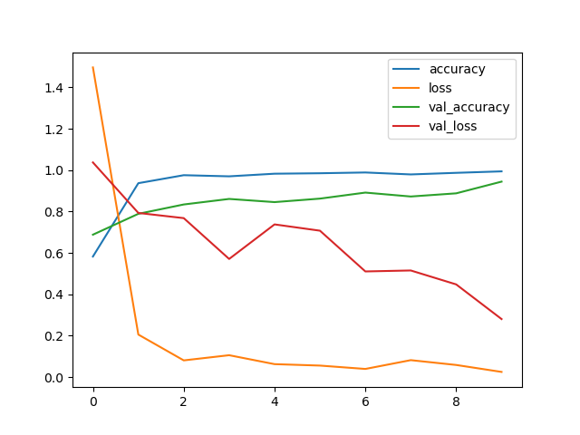

# Custom Multi-Label Image Classifier for Produce Detection

## Overview
This project implements a custom deep learning model for multi-label classification of fruits and vegetables using the YoLo dataset. It serves as an alternative to YOLO for produce detection, focusing on classification accuracy rather than real-time object detection.

## Purpose
- **Learning & Development**: Build deep learning expertise through hands-on implementation
- **CNN Implementation**: Develop convolutional neural networks for image classification
- **Skill Development**: Generate mental trace and deep understanding of CNN architectures
- **Educational Journey**: Progress from classic NN to advanced CNN techniques
- **Performance Exploration**: Train on full YOLO dataset to understand CNN capabilities

## Model Architecture (classic implementation for CPU training)
### Phase 1: Classic Neural Network (Completed)
- **Input**: Flattened image features
- **Hidden Layers**: Dense layers with ReLU activation
- **Output**: Multi-label classification with sigmoid
### Phase 2: Convolutional Neural Network (Current)
- **Input**: Full YOLO dataset images (maintaining spatial structure)
- **Architecture**: CNN layers with convolution, pooling, and dense layers
- **Goal**: Learn CNN implementation and training on real-world image data
- **Focus**: Skill development rather than beating YOLO performance
### Phase 3: Directly use the YoLo library
- **Input**: Full YOLO dataset images (maintaining spatial structure)
- **Architecture**: Use pre-trained YoLo model for classification
- **Goal**: Learn how to use pre-trained models and fine-tune them for specific tasks
- **Focus**: Skill development rather than beating YOLO performance
## CNN Implementation Goals
- **Educational**: Master CNN concepts through practical implementation
- **Hands-on Experience**: Work with real image datasets and CNN architectures
- **Deep Learning Skills**: Develop comprehensive understanding of:
  - Convolutional layers and feature extraction
  - Pooling layers and spatial dimensionality reduction
  - CNN-specific optimization techniques
  - Image preprocessing and augmentation
- **Mental Trace**: Build strong foundation for future deep learning projects
## Training Dataset
- **Source**: Full YOLO image dataset
- **Scale**: Large-scale image classification task
- **Complexity**: Real-world produce images with varying conditions
- **Purpose**: Practice CNN implementation on substantial dataset
## Performance Expectations
- **Primary Goal**: Learning and skill development
- **Secondary**: Achieve reasonable classification performance
- **Benchmark**: Personal improvement and understanding rather than YOLO competitio

## Model Architecture (using PyTorch with CUDA support)
The model is a deep neural network with the following architecture:
- Input: 64x64x3 RGB images (flattened to 12,288 features)
- Hidden Layers: 
  - Linear(12288, 2048) + ReLU
  - Linear(2048, 1024) + ReLU 
  - Linear(1024, 512) + ReLU
  - Linear(512, 256) + ReLU
  - Linear(256, 128) + ReLU
- Output: Linear(128, 63) with sigmoid activation for multi-label classification

## Performance
- **Accuracy**: ~98.5% on test set
- **Training Time**: Varies by hardware (typically 10-30 minutes on GPU)

## Comparison with YOLO

| Feature | This Model | YOLO v9 |
|---------|------------|---------|
| **Purpose** | Multi-label classification | Object detection + classification |
| **Speed** | Faster inference (classification only) | Slower (detection + classification) |
| **Accuracy** | High for classification | High for detection + classification |
| **Use Case** | When you only need classification | When you need bounding boxes |
| **Training Data** | Requires pre-cropped images | Uses full images with bounding boxes |
| **Output** | Class probabilities | Bounding boxes + class probabilities |

## Installation

1. Clone the repository:
   ```bash
   git clone https://github.com/hungh/YoLoL
   cd YoLoL
   ```

2. Install dependencies:
   ```bash
   pip install -e .
   ```

3. Run the training script:
   ```bash
   python -m src.classic_train model_name
   
   # Available models:
   # python -m src.classic_train binary
   # python -m src.classic_train multi_label
   # python -m src.classic_train batch_norm
   # python -m src.classic_train binary_adam
   # python -m src.classic_train multi_label_adam
   ```
   
4. Run the training script:
  ResNet50
   ```bash
   python -m src.tf_train.resnet resnet50
   ```
  to enable GPU training on Apple Silicon, tetnsorflow-macos and tensorflow-metal are required
   ```bash
   pip install tensorflow-macos tensorflow-metal
   ```

## DEBUGGING & MONITORING

### Training History Tracking

This repository includes comprehensive training history tracking using TensorBoard. The system automatically logs:

- **Parameters**: Weight and bias evolution
- **Gradients**: Gradient norms and distributions  
- **Costs**: Training and validation losses
- **Metrics**: Custom performance metrics

### Prerequisites

Install the required dependencies:
```bash
pip install torch tbparse tensorboard
```
### During Training

You can monitor the training process in real-time using TensorBoard. Run the following command in the terminal:
```bash
tensorboard --logdir=logs
```

### Post Training

You can find the history writer in the src/history directory.
To extract the history, you can use the following code:

1. Start Jupyter Notebook from repository root
```bash
jupyter lab
```
2. Load the history reader in a notebook cell:

```python
%run src/history/history_reader_script.py
```
3. Explore the data:

```python
# View all training records
df.head()

# Get gradient norms for a specific epoch
gradients_epoch_2100 = reader.get_gradients(epoch=2100)

# Filter specific batch gradients
batch_3_gradients = df[
    (df['step'] == 2100) & 
    (df['tag'].str.startswith('/batch_no_3/gradients/'))
]

# Analyze parameter evolution
w1_params = reader.get_parameters()
w1_params[w1_params['tag'].str.contains('/W1')]
```
4. Common Queries:

```python
# Check for gradient explosions
max_grad_norms = df[df['tag'].str.contains('_norm')].groupby('step')['value'].max()

# Compare training vs validation costs
costs = reader.get_costs()
epoch_costs = costs.groupby('step')['value'].mean()

# Monitor specific layer gradients
layer_gradients = df[df['tag'].str.contains('/gradients/dW3')]
```

## Data assets structure
```
assets/ 
├── mnist/ 
│ └── signs/ # Sign Language MNIST dataset 
│ ├── sign_mnist_train.csv # Training data (27,455 samples) 
│ ├── sign_mnist_test.csv # Test data (7,172 samples)
├── produce_dataset/ # Custom generated datasets 
│ ├── *.npy # NumPy data files
│ ├── *.npz # Compressed NumPy arrays 
│ └── *.csv # CSV data files 
└── images/ # Training results and visualizations 
└── saved_model_dir/ # Saved model directory
└── history/ # Training history directory
└── logs/ # TensorBoard logs
```

### Dataset Details

- **SignMNIST**: American Sign Language letters (A-Z, 26 classes)
- **Image Size**: 28x28 grayscale images
- **Training Samples**: 27,455 images
- **Test Samples**: 7,172 images
- **Format**: CSV with pixel values (0-255) and labels (0-25)

## Package Structure

```
src/
├── classic_nn/                    # Core neural network implementation
│   ├── __init__.py                # Main neural network functions (forward, backward, parameter updates)
│   ├── batch_norm/                # Batch normalization implementation
│   │   ├── __init__.py           # Batch norm integration with neural networks
│   │   ├── forward/              # Forward propagation with batch normalization
│   │   │   └── __init__.py       # Batch norm forward pass, caching, Z computation
│   │   └── backward/             # Backward propagation for batch normalization
│   │       └── __init__.py       # Batch norm backward pass, gradient calculations
│   ├── data_utils/               # Data generation and preprocessing utilities
│   │   └── __init__.py           # Multi-label and binary dataset generators
│   ├── loss/                     # Loss functions
│   │   └── __init__.py           # Binary cross-entropy with logits loss
│   ├── math/                     # Mathematical activation functions
│   │   └── __init__.py           # Sigmoid, ReLU, Tanh activation functions
│   ├── optimizers/               # Optimization algorithms
│   │   ├── __init__.py           # Optimizer factory (Adam, Momentum, RMSProp)
│   │   ├── adam/                 # Adam optimizer implementation
│   │   │   └── __init__.py       # Adaptive moment estimation with bias correction
│   │   ├── momentum/             # Momentum optimizer implementation
│   │   │   └── __init__.py       # Velocity-based parameter updates
│   │   └── rms_prop/             # RMSProp optimizer implementation
│   │       └── __init__.py       # Adaptive learning rate with squared gradients
│   ├── regularization/           # Regularization techniques
│   │   └── __init__.py           # L2 regularization for weights and batch norm params
│   └── utils/                    # Utility functions
│       ├── __init__.py           # PCA plotting, decision boundaries, cost plotting
│       └── eval.py               # Model evaluation utilities
├── classic_cnn/                  # Convolutional Neural Network implementation
│   ├── __init__.py               # CNN package initialization
│   ├── backward/                 # Backward propagation for CNN layers
│   │   └── __init__.py           # Convolution backward pass implementation
│   ├── forward/                  # Forward propagation for CNN layers
│   │   └── __init__.py           # Convolution forward pass implementation
│   ├── pooling/                  # Pooling layer implementations
│   │   ├── __init__.py           # Pooling package initialization
│   │   ├── forward/              # Forward pooling operations
│   │   │   └── __init__.py       # Max and average pooling forward pass
│   │   ├── backward/             # Backward pooling operations
│   │   │   └── __init__.py       # Max and average pooling backward pass
│   │   └── utils/                # Pooling utility functions
│   │       └── __init__.py       # Mask creation and value distribution
│   └── utils/                    # CNN utility functions
│       └── __init__.py           # Zero padding and other CNN utilities
├── classic_train/                # Training scripts and trainers
│   ├── __init__.py               # Package initialization
│   ├── __main__.py               # Main entry point for training
│   ├── binary_model.py           # Binary classification training script
│   ├── multi_label_model.py      # Multi-label classification training script
│   ├── batch_norm_model.py       # Batch normalization training script
│   ├── binary_model_adam.py      # Binary classification with Adam optimizer
│   ├── multi_label_model_adam.py # Multi-label classification with Adam optimizer
│   ├── mini_batch_generic.py     # Deprecated mini-batch trainer (backward compatibility)
│   └── mini_batch/               # Mini-batch training package
│       ├── __init__.py           # Package initialization
│       ├── trainer.py            # MiniBatchTrainer class for training loops
│       ├── trainer_with_adam.py   # TrainerWithAdam class with Adam optimizer integration
│       ├── metrics.py            # Multi-label evaluation metrics
│       └── utils.py              # Mini-batch data generation utilities
├── inference/                    # Model inference utilities
├── load/                         # Model loading utilities
└── torch_train/                  # PyTorch-based training implementations
```
### Package Meanings and Key Components

#### [classic_nn/](cci:9:hungd/git/YoLoL/src/classic_nn:0:0-0:0) - Core Neural Network Library
- **Purpose**: Fundamental neural network operations and mathematical functions
- **Key Functions**:
  - `custom_model_forward()`: Complete forward propagation through all layers
  - `custom_model_backward()`: Complete backward propagation (gradient computation)
  - `initialize_parameters_deep()`: Weight and bias initialization
  - `update_parameters()`: Parameter updates with optimizer support

#### [batch_norm/](cci:9:hungd/git/YoLoL/src/classic_nn/batch_norm:0:0-0:0) - Batch Normalization
- **Forward Pass** (`forward/__init__.py`):
  - Computes batch statistics (mean, variance)
  - Normalizes activations: `Z_norm = (Z - μ) / sqrt(σ² + ε)`
  - Scales and shifts: `Z̃ = γZ_norm + β`
  - Caches intermediate values for backward pass
  
- **Backward Pass** (`backward/__init__.py`):
  - Computes gradients for γ (gamma) and β (beta) parameters
  - Reconstructs original Z from cached values
  - Handles gradient flow through normalization steps

#### [optimizers/](cci:9:hungd/git/YoLoL/src/classic_nn/optimizers:0:0-0:0) - Optimization Algorithms
- **Momentum**: `v_t = βv_{t-1} + (1-β)∇J`, `θ_t = θ_t - αv_t`
- **RMSProp**: `s_t = βs_{t-1} + (1-β)∇J²`, `θ_t = θ_t - α∇J / sqrt(s_t + ε)`
- **Adam**: Combines momentum and RMSProp with bias correction

#### [classic_train/](cci:9:hungd/git/YoLoL/src/classic_train:0:0-0:0) - Training Scripts
- **MiniBatchTrainer**: Complete training loop with validation, metrics, and plotting
- **Training Models**: Binary, multi-label, and batch normalization examples
- **Metrics**: Exact match, Hamming loss, F1 score for multi-label evaluation

#### Forward and Backward Propagation Flow
1. **Forward**: Input → Linear → Batch Norm (optional) → Activation → ... → Output
2. **Loss**: Compute loss between predictions and targets
3. **Backward**: Output loss → Activation gradients → Linear gradients → Batch norm gradients → ... → Input gradients
4. **Update**: Use optimizer to update parameters based on gradients

This modular structure allows for easy experimentation with different architectures, optimizers, and training strategies while maintaining clean separation of concerns.

## When to Use This Model

- **Classification-Only Tasks**: When you only need to classify pre-cropped images
- **Resource-Constrained Environments**: Lower computational requirements than YOLO
- **Educational Purposes**: Simpler architecture for learning and experimentation
- **Baseline Model**: As a reference for comparing with more complex models

## When to Use YOLO

- **Object Detection**: When you need to detect and locate multiple objects
- **Real-Time Applications**: When you need both detection and classification
- **Variable Input Sizes**: When input image sizes vary significantly
- **Production Deployment**: When you need a battle-tested solution

## Trade-offs

### Simplicity vs. Functionality
- **This Model**: Simpler but only handles classification
- **YOLO**: More complex but handles both detection and classification

### Performance
- **This Model**: Faster for pure classification tasks
- **YOLO**: Slower but provides object localization

### Training Data
- **This Model**: Requires pre-processed crops
- **YOLO**: Works with raw images and annotations

### Training Results
- **ResNet50**: A deep residual network for image classification (using a tensorflow implementation with a custom BatchNormalization layer)
with 10 epochs and batch size of 32
```bash
Epoch 1/10
858/858 ━━━━━━━━━━━━━━━━━━━━ 167s 181ms/step - accuracy: 0.5824 - loss: 1.4964 - val_accuracy: 0.6880 - val_loss: 1.0371
Epoch 2/10
858/858 ━━━━━━━━━━━━━━━━━━━━ 152s 178ms/step - accuracy: 0.9368 - loss: 0.2052 - val_accuracy: 0.7888 - val_loss: 0.7929
Epoch 3/10
858/858 ━━━━━━━━━━━━━━━━━━━━ 155s 180ms/step - accuracy: 0.9755 - loss: 0.0803 - val_accuracy: 0.8339 - val_loss: 0.7679
Epoch 4/10
858/858 ━━━━━━━━━━━━━━━━━━━━ 156s 182ms/step - accuracy: 0.9700 - loss: 0.1053 - val_accuracy: 0.8607 - val_loss: 0.5706
Epoch 5/10
858/858 ━━━━━━━━━━━━━━━━━━━━ 149s 174ms/step - accuracy: 0.9827 - loss: 0.0622 - val_accuracy: 0.8454 - val_loss: 0.7376
Epoch 6/10
858/858 ━━━━━━━━━━━━━━━━━━━━ 151s 176ms/step - accuracy: 0.9849 - loss: 0.0552 - val_accuracy: 0.8622 - val_loss: 0.7072
Epoch 7/10
858/858 ━━━━━━━━━━━━━━━━━━━━ 157s 183ms/step - accuracy: 0.9886 - loss: 0.0390 - val_accuracy: 0.8914 - val_loss: 0.5103
Epoch 8/10
858/858 ━━━━━━━━━━━━━━━━━━━━ 155s 180ms/step - accuracy: 0.9792 - loss: 0.0814 - val_accuracy: 0.8724 - val_loss: 0.5149
Epoch 9/10
858/858 ━━━━━━━━━━━━━━━━━━━━ 157s 182ms/step - accuracy: 0.9869 - loss: 0.0582 - val_accuracy: 0.8878 - val_loss: 0.4476
Epoch 10/10
858/858 ━━━━━━━━━━━━━━━━━━━━ 158s 184ms/step - accuracy: 0.9940 - loss: 0.0245 - val_accuracy: 0.9444 - val_loss: 0.2801
225/225 ━━━━━━━━━━━━━━━━━━━━ 7s 31ms/step - accuracy: 0.9444 - loss: 0.2801
``` 

